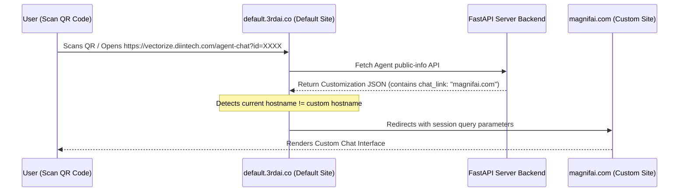

# 🌐 Custom Chat Link & Webhook Redirect Setup Guide (Step-by-Step)

This guide explains how to host the sub-agent chat page (`share-agent-chat.html`) on your own custom domain (e.g., `https://magnifai.com`) and configure the admin panel to auto-redirect QR code scans to your custom site.

---

## 📋 Architecture Flow Overview


---

## 🛠️ Step-by-Step Integration

### ➔ Step 0: Prerequisites
Ensure you have the following information and files ready:
1. **FastAPI Backend Base URL**: The URL where your server backend is hosted (e.g., `https://https://vectorize.diintech.com`).
2. **Sub-Agent ID**: The hex identifier for your agent (e.g., `d6b54c1e63290e77`).
3. **Custom Domain Access**: Access to upload files or deploy HTML pages on your custom web server (e.g., `https://magnifai.com`).
4. **File**: [`share-agent-chat.html`](file:///c:/Users/LENOVO/Downloads/mr_ai_rag_v2/mr_ai_rag_v2/frontend/share-agent-chat.html) page file.

---

### ➔ Step 1: Configure `share-agent-chat.html`
Before hosting the file on your server, you need to point it to your FastAPI backend.

1. Open [`share-agent-chat.html`](file:///c:/Users/LENOVO/Downloads/mr_ai_rag_v2/mr_ai_rag_v2/frontend/share-agent-chat.html) in a code editor.
2. Locate the configuration setting at the top of the main `<script>` tag:
   ```javascript
   const BACKEND_URL = "https://https://vectorize.diintech.com"; // Replace with your backend domain
   ```
3. Update `BACKEND_URL` to match your live FastAPI server address (do not add a trailing slash `/`).
4. Save the file.

---

### ➔ Step 2: Deploy to Your Custom Domain (`magnifai.com`)
Aapke custom website development framework ke according, niche diye gaye methods me se jo aapke setup ko match kare usko choose karein:

#### 📂 Case A: Standard HTML Website (cPanel, Apache, Nginx, or GoDaddy)
Standard HTML configurations me folder structure manually manage hota hai:
1. Apne website hosting directory me jayein (normally iska name **`public_html`**, **`www`**, ya **`public`** hota hai).
2. Root directory ke andar ek naya folder banayein jiska name rakhein **`agent-chat`**.
3. Apne `share-agent-chat.html` file ko rename karke **`index.html`** kar dein.
4. Is `index.html` file ko **`agent-chat`** folder ke andar upload kar dein.

* **Folder Path Layout**:
  ```text
  public_html/
  ├── index.html (Aapki main website)
  └── agent-chat/
      └── index.html (Rename kiya hua share-agent-chat.html)
  ```
* **Accessible URL**: `https://magnifai.com/agent-chat?id=YOUR_AGENT_ID`

---

#### 📂 Case B: React Website (Vite, Create React App, or Webpack)
React projects build step ke dauran normal HTML compiled assets me convert hote hain. React me static assets serve karne ke liye **`public`** directory ka use kiya jata hai:
1. Apne React codebase ke root folder me jayein.
2. Root level pe located **`public/`** folder ke andar ek naya sub-folder banayein jiska name rakhein **`agent-chat`**.
3. Apne `share-agent-chat.html` file ko rename karke **`index.html`** kar dein.
4. Is `index.html` file ko **`public/agent-chat/`** ke andar save kar dein.

* **Folder Path Layout**:
  ```text
  my-react-app/
  ├── src/
  ├── package.json
  └── public/
      └── agent-chat/
          └── index.html (Rename kiya hua share-agent-chat.html)
  ```
* **Vite/Build Note**: Jab aap `npm run build` run karenge, Vite automatically `public` folder ke contents ko copy karke `dist/` build output folder ke root me move kar dega.
* **Accessible URL**: `https://magnifai.com/agent-chat?id=YOUR_AGENT_ID`

---

#### 📂 Case C: Next.js Website (App Router or Pages Router)
Next.js me custom pages standard components ki tarah design hote hain, lekin static HTML files ko handle karne ke liye Next.js me static routing support hota hai:
1. Next.js codebase ke root me located **`public/`** directory me jayein.
2. Ek naya sub-folder banayein jiska name rakhein **`agent-chat`**.
3. Apne `share-agent-chat.html` file ko rename karke **`index.html`** kar dein.
4. Is file ko **`public/agent-chat/`** directory ke andar place kar dein.

* **Folder Path Layout**:
  ```text
  my-next-app/
  ├── app/ (or pages/)
  ├── package.json
  └── public/
      └── agent-chat/
          └── index.html (Rename kiya hua share-agent-chat.html)
  ```
* **Accessible URL**: `https://magnifai.com/agent-chat?id=YOUR_AGENT_ID`

---

### ➔ Step 3: Link Custom URL in Admin Panel
Now, configure the system to recognize your custom domain.

1. Log in to your **MR AI RAG v2 Admin Dashboard** (e.g., `https://https://vectorize.diintech.com/login`).
2. Go to the **Agents** tab and click **Edit Settings** for your target sub-agent.
3. Switch to the **Customization** tab.
4. Locate the field labeled **"Custom Chat Link (Webhook / Custom Chat URL)"**.
5. Input your custom URL:
   `https://magnifai.com/agent-chat` (or `https://magnifai.com/agent-chat?id=YOUR_AGENT_ID`).
6. Click **Save Changes**.

---

### ➔ Step 4: Redirection & QR Code Behavior
The frontend page has built-in auto-redirection logic. Here is how it behaves:

1. **How QR Code Redirection Works**:
   - The QR code dynamically generated in the admin panel points to the default landing URL:
     `https://https://vectorize.diintech.com/agent-chat?id=YOUR_AGENT_ID`
   - When a user scans the QR code, the default page loads and queries the backend database for the agent's customization settings.
   - The javascript detects that a `chat_link` (e.g., `magnifai.com`) is configured and compares hostnames.
   - If the current domain is not `magnifai.com`, it triggers:
     `window.location.replace("https://magnifai.com/agent-chat?id=YOUR_AGENT_ID&session_id=...&device_id=...")`
   - The user is redirected to your custom domain seamlessly within milliseconds.

2. **Local Debugging/Developer Bypass**:
   - The redirect code automatically ignores `localhost` and `127.0.0.1`.
   - If developers run the project locally to test UI or API code, the redirection is skipped, permitting safe debug configurations.

---

### ➔ Step 5: Test and Verify
1. Go to your dashboard and generate the QR code for your sub-agent.
2. Scan the QR code using a smartphone.
3. Verify that the mobile browser opens `https://vectorize.diintech.com` briefly, then redirects automatically to `https://magnifai.com/agent-chat` with the correct query parameters and loads your sub-agent chat view.
