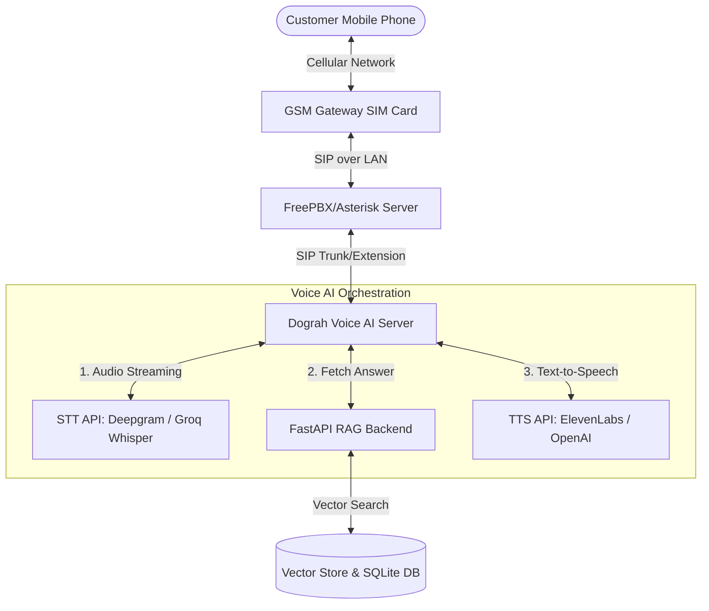

# GSM Gateway + FreePBX + Dograh AI Voice Telephony Setup Guide

This guide explains how to build a highly cost-effective, self-hosted voice AI telephony system by replacing cloud telephony (Vobiz) with local SIM-based hardware (GSM Gateway), FreePBX (Asterisk), and Dograh Voice AI.

---

## 🏗️ System Architecture



---

## 🔌 Hardware & Network Requirements

To implement this setup, you need the following hardware:

| Item | Description | Approx Cost (INR) | Recommended Brands |
| :--- | :--- | :--- | :--- |
| **GSM Gateway** | A hardware device that converts SIM card cellular signals to VoIP (SIP). Choose ports depending on concurrent calls needed (e.g., 4-port = 4 concurrent calls). | ₹12,000 - ₹20,000 | Dinstar (UC2000), Synway, OpenVox, Matrix |
| **SIM Cards** | Regular mobile SIM cards with unlimited calling packs (Jio, Airtel, or Vi). | ₹150 - ₹250 / month | Jio / Airtel |
| **Host Machine** | A mini-PC, old desktop, or dedicated local server to run FreePBX and Dograh. Minimum: 8GB RAM, 4 Core CPU, Ubuntu Server installed. | ₹15,000 - ₹25,000 | Intel NUC, Lenovo ThinkCentre Mini, or any VPS (if public IP is available) |

---

## 🛠️ Step-by-Step Setup Instructions

### Step 1: Configure the GSM Gateway
1. **Network Connection**: Plug the GSM Gateway into your local router/switch using an Ethernet cable. Power it on.
2. **Access Web Panel**: Find the gateway's IP address from your router's DHCP client list (e.g., `192.168.1.150`). Open it in a web browser. (Default credentials are usually `admin` / `admin`).
3. **SIM Activation**: Insert your SIM cards. Go to **Mobile Status** to confirm they register with the network carrier and show strong signal strength.
4. **Configure SIP Server (SIP Trunk)**:
   - Navigate to **SIP Settings** -> **SIP Trunk**.
   - Create a new SIP trunk pointing to your FreePBX Server IP (e.g., `192.168.1.200` on port `5060`).
5. **Set Routing Rules**:
   - **Mobile to IP (Inbound)**: Create a rule routing all incoming calls from SIMs to the FreePBX SIP trunk.
   - **IP to Mobile (Outbound)**: Create a rule routing outgoing calls from the FreePBX SIP trunk out through the SIM channels.

---

### Step 2: Install & Configure FreePBX (Asterisk)
FreePBX is the PBX engine that handles call queuing, extension management, and routing.

1. **Install FreePBX**:
   - Download the official [FreePBX ISO](https://www.freepbx.org/downloads/) and install it on your Host Machine (bare metal or VirtualBox/Proxmox VM).
   - Once installed, access the FreePBX dashboard via browser (e.g., `http://192.168.1.200`).
2. **Configure GSM Gateway SIP Trunk**:
   - Go to **Connectivity** -> **Trunks** -> **Add SIP (chan_pjsip) Trunk**.
   - Set **Trunk Name** (e.g., `GSM_Gateway_Trunk`).
   - In **pjsip Settings**:
     - *SIP Server*: IP of your GSM Gateway (e.g., `192.168.1.150`).
     - *Port*: `5060`.
3. **Create an Extension for Dograh**:
   - Dograh needs to log in to FreePBX as a SIP user to send/receive calls.
   - Go to **Applications** -> **Extensions** -> **Add New PJSIP Extension**.
   - Set **User Extension** (e.g., `8001`) and **Display Name** (e.g., `Dograh_Voice_AI`).
   - Note down the extension number (`8001`) and the generated **Secret/Password**.
4. **Configure Routing**:
   - **Inbound Route**: Go to **Connectivity** -> **Inbound Routes**. Route all calls coming through the `GSM_Gateway_Trunk` to **Extension 8001** (Dograh).
   - **Outbound Route**: Go to **Connectivity** -> **Outbound Routes**. Route patterns (like `X.`) to use the `GSM_Gateway_Trunk`.

---

### Step 3: Install & Configure Dograh
Dograh runs on the same Host Machine using Docker. It connects to FreePBX using the SIP credentials created above.

1. **Run Dograh via Docker**:
   Run the local Docker Compose script on your Linux Host Machine:
   ```bash
   curl -o docker-compose.yaml https://raw.githubusercontent.com/dograh-hq/dograh/main/docker-compose.yaml
   curl -o start_docker.sh https://raw.githubusercontent.com/dograh-hq/dograh/main/scripts/start_docker.sh
   chmod +x start_docker.sh
   ./start_docker.sh
   ```
2. **Access Dograh Web Console**:
   Go to `http://localhost:3010` in your browser.
3. **Add SIP Credentials**:
   - In Dograh dashboard, go to **Telephony Providers** -> **Add SIP Trunk / Register Client**.
   - Enter your FreePBX server details:
     - **Username / Extension**: `8001`
     - **Password**: The secret generated in FreePBX Extension 8001.
     - **Domain / Registrar**: `192.168.1.200` (FreePBX IP)
   - Ensure the connection shows **Registered/Connected**.

---

### Step 4: Integrate the FastAPI RAG Backend
Now you connect the visual AI Agent in Dograh to your existing Python FastAPI code.

1. **Configure Agent in Dograh**:
   - Create a new Voice Agent in the Dograh UI.
   - Set **STT** (e.g. Deepgram or Groq Whisper).
   - Set **TTS** (e.g. ElevenLabs or OpenAI Nova).
   - For the **LLM**, choose **Custom LLM** or **OpenAI-Compatible Endpoint**.
2. **Point Custom LLM to FastAPI**:
   - Put your server's endpoint: `http://<your-fastapi-ip>:8000/api/agents/{agent_id}/public-ask` (or you can create a simple wrapper route matching OpenAI's chat completions format `/v1/chat/completions`).
   - If Dograh is running on the same network/host, you can use local IPs.
3. **Configure Tool Call (For Daily Planner)**:
   - Within Dograh's Agent Node, define an **HTTP API Tool** mapping to your planner endpoint: `POST http://<your-fastapi-ip>:8000/api/agents/{agent_id}/book-meeting`.
   - When the caller says *"Schedule my meeting for 3 PM tomorrow"*, Dograh's LLM automatically invokes this HTTP Tool, passing the date, name, and details back to your FastAPI backend database.

---

## 💰 Cost Comparison: Vobiz Cloud vs. Local Setup

| Expense Item | Vobiz Cloud Telephony | Local GSM + FreePBX + Dograh Setup |
| :--- | :--- | :--- |
| **Initial Hardware Setup** | ₹0 | ₹27,000 (One-time: Gateway + Mini PC) |
| **Server Hosting / VPS** | Included | ₹500 - ₹1,000 / month (Or ₹0 if hosted on local PC) |
| **Outbound Calling Charges** | ~₹0.80 - ₹1.20 / minute | **₹0 / minute** (Included in Unlimited SIM Plans) |
| **Monthly Bill (10k Call Mins)**| **₹10,000 - ₹12,000** | **₹200 - ₹300** (Unlimited SIM Recharge) |

---

## 🚦 Verification Checklist
- [ ] GSM Gateway registered with cell towers (network signal LED is solid/green).
- [ ] FreePBX shows active trunk status with GSM Gateway.
- [ ] Dograh registers successfully to FreePBX Extension `8001`.
- [ ] Call the SIM card phone number -> phone rings -> Dograh picks up -> AI speaks.
- [ ] Ask the AI to save a plan -> check `daily_planer_api.md` logs -> database reflects new entry.
